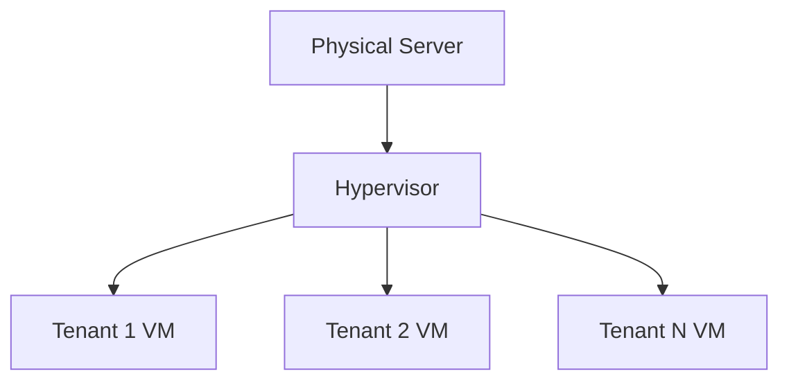

# AWS Semester preparation

## MCQS
### Which AWS service is used to launch and manage virtual servers in the cloud?
- Amazon EC2

### What does the "R" stand for in the AWS service "Amazon RDS"?
- Relational

### Which AWS service can be used to distribute content globally and improve website performance?
- Amazon CloudFront

### What does the acronym "IAM" stand for in AWS?
- Identity and Access Management

### What AWS service is used to create and manage virtual private networks (VPNs) in the cloud?
- Amazon VPC

### Which AWS service can be used to automatically scale EC2 instances based on demand?
- Amazon EC2 Auto Scaling

### What is the purpose of AWS Lambda?
- Running code without provisioning or managing servers

### Which AWS service provides a scalable, fully managed NoSQL database?
- Amazon DynamoDB

### What AWS service can be used to monitor and gain insights into application performance?
- AWS CloudWatch

### Which AWS service can be used to manage and monitor containerized applications?
- Amazon ECS (or Amazon EKS for Kubernetes)

### What is the purpose of AWS CloudFront?
- Delivering content to users with low latency from edge locations

### What is the region in AWS?
- A region is a geographical area or collection of data centers.

### What does S3 stand for in AWS?
- Simple Storage Service

### How many types of storage classes does the S3 contain?
- **6** (Standard, Intelligent-Tiering, Standard-IA, One Zone-IA, Glacier Instant Retrieval, Glacier Flexible Retrieval, Glacier Deep Archive, S3 Outposts)


### Among all S3 storage classes, which storage class is used for data that is rarely accessed but requires rapid response when needed?
- **S3 Standard-IA (Infrequent Access)**

### In the VMware full virtualization model, the hypervisor is in Ring 
- **0**

### A hypervisor recreates a hardware environment in which ____ operating systems are installed.
- **virtual**

### ______ is a cloud computing infrastructure that creates a development environment upon which applications may be built.
- **Platform as a Service (PaaS)**

### ______ cloud is one where the cloud has been organized to serve a common function or purpose.
- **Community**

### Cloud computing is a _____ system and it is necessarily unidirectional in nature.
- **stateless**

## Mod 1
### 1. (a) Write two advantages of perceiving infrastructure as software in the Cloud environment rather than as hardware in the traditional IT environment.

 **Scalability & Elasticity** – Cloud infrastructure can be dynamically scaled via software (e.g., AWS Auto Scaling), unlike physical hardware upgrades.  
**Automation & Speed** – Infrastructure-as-Code (IaC) tools (e.g., AWS CloudFormation) enable fast, repeatable deployments with fewer manual errors.  

### 1(b)    _____-as-a-Service Services provides you with a completed product that the service provider runs and manages. Give two examples of the same.

**Software-as-a-Service (SaaS)**  
**Examples:**  
- **Salesforce** (Cloud-based CRM managed by Salesforce).  
- **Microsoft 365** (Productivity suite managed by Microsoft).
  
### 1(c)  A community cloud serves a group of Cloud Consumers with shared concerns such as _______, rather than serving a single organization as does a private cloud.

**Regulatory compliance, security policies, or industry standards** (e.g., banks sharing a **PCI-DSS compliant** cloud).

### 1(d) Describe the ownership dimension of the cloud cube model.

The **Cloud Cube Model** (Jericho Forum) defines four dimensions, including:  
| Ownership Type | Description | Example |  
|--------------|------------|---------|  
| **Proprietary** | Owned by a single entity | Private Cloud |  
| **Outsourced** | Owned by a third party | Public Cloud (AWS, Azure) |  
| **Joint Ownership** | Shared by multiple entities | Community Cloud |  

### 1(e) Write two disadvantages of using cloud computing.

- **Vendor Lock-in** – Dependency on a provider’s proprietary tools makes migration difficult.  
- **Security Risks** – Misconfigurations (e.g., exposed S3 buckets) can lead to data breaches.

### 2. (a)   What is meant by Vendor Lock-In? Which service model is most affected by it?

**Vendor Lock-In** refers to the difficulty in migrating from one cloud provider to another due to:
- Proprietary technologies/APIs
- Unique service implementations
- Data format dependencies

**Most Affected Service Model:**  
**Platform-as-a-Service (PaaS)** is most susceptible because:
- Applications are built using provider-specific tools
- Middleware and runtime environments are provider-controlled
- Example: Migrating from AWS Elastic Beanstalk to Azure App Service requires significant rework

### 2(b)    What are the five main features or attributes of Cloud Computing according to the NIST model?

The **NIST SP 800-145** defines cloud computing essentials:

1. **On-Demand Self-Service**  
   - Users can provision resources automatically (e.g., spinning up EC2 instances)

2. **Broad Network Access**  
   - Services available over standard networks (HTTP/APIs) from any device

3. **Resource Pooling**  
   - Multi-tenant architecture with shared physical resources (e.g., AWS hypervisors)

4. **Rapid Elasticity**  
   - Auto-scaling capabilities (e.g., AWS Lambda scaling to thousands of instances)

5. **Measured Service**  
   - Pay-per-use billing models (e.g., AWS charging per GB-hour for Lambda)

### 2(c)  Explain service orchestration in Cloud Computing.

**Definition:**  
Automated arrangement and coordination of cloud services to create complex workflows.

**Key Aspects:**  
| Component | Description | Example |
|-----------|-------------|---------|
| **Workflow Automation** | Sequencing tasks across services | AWS Step Functions |
| **Dependency Management** | Handling service interdependencies | Terraform resource chaining |
| **Lifecycle Control** | Managing creation→scaling→termination | Kubernetes Pod lifecycle |

### 3(a)Explain “Pay as you go” and “Measured service” in Cloud computing.

| Concept | Definition | Technical Implementation | AWS Example |
|---------|------------|--------------------------|-------------|
| **Pay as you go** | Payment model where costs align with actual usage | - Per-second billing <br> - No upfront commitments | EC2 instances billed per second after first minute |
| **Measured Service** | Resource usage is monitored and reported transparently | - CloudWatch metrics <br> - Cost Explorer APIs | S3 storage metrics (GB-months) in Cost & Usage Reports |

**Key Difference:**  
- Pay as you go = **Billing model**  
- Measured service = **Monitoring capability** that enables pay-as-you-go

### 3(b) What is the Cloud Cube model? Mention the four dimensions of the Cloud Cube model.


#### Four Dimensions Explained:
**Ownership**
- Proprietary (Private cloud)
- Outsourced (Public cloud)
- Joint (Community cloud)

**Location**
- Internal (On-premises)
- External (Provider datacenters)
- Mixed (Hybrid cloud)

**Security Boundary**
- Perimeterized (Traditional firewall)
- De-perimeterized (Zero-trust models)

**Sourcing**
- Insourced (Self-managed)
- Outsourced (Third-party managed)

### 3(c)  Critically comment on the terms “Elasticity” and “Scalability” with respect to Cloud Computing.

#### Elasticity:
**Automated scaling based on workload fluctuations**
- Critical Advantage: Handles unpredictable bursts (e.g., Black Friday traffic)
- Implementation Challenge: Requires proper auto-scaling policies to avoid thrashing

#### Scalability:
**Ability to handle growing workload by adding resources**
- Critical Advantage: Supports planned growth (e.g., database sharding)
- Implementation Challenge: Often requires architectural changes (horizontal vs vertical)

### 4(a) Consider the following scenario: An educational and research organization is interested to install Cloud. The stakeholders are professors, research fellows, and students. Professors share study materials and take online exams. Research fellows execute complex algorithms. Students discuss doubts in forums. Answer the following questions: 1. Which deployment model is suitable? 2. Why have you chosen this deployment model? Explain with proper justification.

**Recommended Model**: Community Cloud

**Justification Matrix**:

| Requirement               | Community Cloud Solution                 | Technical Advantage                              | AWS Service Reference               |
|---------------------------|------------------------------------------|------------------------------------------------|-------------------------------------|
| **Shared academic resources** | Dedicated IAM policies for role-based access | Centralized permission management with attribute-based controls | AWS SSO + IAM Roles |
| **High-performance computing** | Shared GPU instances for researchers | Low-latency RDMA networking for MPI workloads | EC2 P3dn.24xlarge (8x NVIDIA V100) |
| **Bursty exam loads**      | Auto-scaling for LMS platforms          | Machine-learning driven capacity forecasting   | ASG with Predictive Scaling Policy |
| **Data sovereignty**       | Compliant storage for research data     | WORM (Write-Once-Read-Many) compliance         | S3 Object Lock (Governance Mode)   |

### 4(b) Differentiate between the horizontal scaling and the vertical scaling policies.

#### Horizontal Scaling ("Scale-out")
- Adds more nodes to the system
- AWS Example: Adding EC2 instances behind ALB
- Best for: Stateless workloads (web servers)
- Requires load balancing
- Needs distributed architecture

#### Vertical Scaling ("Scale-up")
- Increases node capacity (CPU/RAM)
- AWS Example: Upgrading from t3.medium to t3.xlarge
- Best for: Monolithic apps (SQL databases)
- Has hardware limits
- Requires downtime

### 4(c) Define the five actors in the NIST Reference model.

**Cloud Consumer**
- End-users consuming services (Students/professors in 4a scenario)
- Technical Interface: AWS Console/CLI

**Cloud Provider**
- Delivers cloud services (AWS/Azure)
- Core Components: Compute/Storage/Network services

**Cloud Auditor**
- Independent security assessors
- Tools: AWS Audit Manager, PCI-DSS compliance checks

**Cloud Broker**
- Service aggregators/managers
- Example: AWS Managed Services (AMS)

**Cloud Carrier**
- Network transit providers
- Infrastructure: AWS Direct Connect partners

### 5(a) Explain “Multi-tenancy” and “Rapid provisioning” in Cloud Computing.
**Multi-tenancy**

**Definition**: Architectural pattern where single instance serves multiple customers ("tenants")

**Key Characteristics**: Resource isolation through logical separation (not physical)

**AWS Example** : Amazon RDS multi-tenant DB instances

**Advantage** : Cost efficiency through shared infrastructure

**Rapid Provisioning** refers to the cloud's ability to deploy compute/storage/network resources **on-demand within minutes or seconds**, compared to traditional IT's weeks-long procurement cycles.

#### Technical Enablers of Rapid Provisioning

| Technology                      | Role                                   | AWS Example                          |
|---------------------------------|----------------------------------------|--------------------------------------|
| **Infrastructure-as-Code (IaC)** | Declarative template-based deployment  | AWS CloudFormation<br>Terraform AWS Provider| 
| **Virtualization**              | Hardware abstraction via hypervisor    | EC2 Nitro System<br>(NVMe SSD + SR-IOV networking)| 
| **Containerization**            | OS-level virtualization                | ECS Fargate<br>EKS with Firecracker |
| **APIs**                        | Programmatic resource control          | AWS SDK (boto3)<br>AWS CLI (v2)     |

### 5(b)    What do the internal and external dimensions of the Cloud Cube model signify?

## Cloud Cube Model: Internal vs External Dimensions

| Dimension        | Internal (On-Premises)                | External (Public Cloud)               |
|------------------|---------------------------------------|---------------------------------------|
| **Scope**        | Private data centers                  | AWS/GCP/Azure regions                 |
| **Control**      | Full root access                      | Limited by CSP APIs/SLAs              |
| **Networking**   | Customer-managed routers/switches     | AWS Direct Connect/VPC                |
| **Security**     | On-prem firewalls (Palo Alto)         | AWS Shield Advanced + WAF             |
| **Compliance**   | Self-audited                          | Shared responsibility model           |
| **Latency**      | <1ms (LAN)                           | 5-100ms (Internet/VPN)                |

### 5(c)  What is a middleware layer? In the Cloud, who uses the middleware layer? Who installs or manages the middleware layer in the Cloud?

**Definition**: Software glue between OS and applications

**Provides services like**:
- Authentication
- Messaging
- API mediation 

**Users**:
- Application Developers: Utilize middleware services via APIs
- DevOps Engineers: Configure middleware through IaC

**Management**:

| Deployment Model	| Responsibility Party |
|-------------------|----------------------|
| IaaS	| Customer-managed |
| PaaS	| Shared responsibility |	
| SaaS	| Provider-managed |

### 6(a) “Cloud Computing has evolved from mainframe, cluster computing, and grid computing and has features of each of these three technologies”---Comment on this statement.

Ans. 
**Mainframes:**
- These were the first examples of large computational facilities leveraging multiple processing units specialized for large data movement and massive input/output (I/O) operations.
- A supercomputer is designed for high-speed calculations and complex scientific computations, prioritizing raw processing power.

**Cluster Computing:**
- Cluster computing started as a low-cost alternative to the use of mainframes and supercomputers.
- One of the attractive features of clusters was that the computational power of commodity machines could be leveraged to solve problems that were previously manageable only on expensive supercomputers.

**Grid Computing**
- Grids were initially developed as aggregations of geographically dispersed clusters using Internet connections.
- These clusters belonged to different organizations, and arrangements were made among them to share the computational power. This is an analogy to the power grid.

**Cloud Computing**
- Computing clouds are deployed in large data centers hosted by a single organization that provides services to others.
- Clouds are characterized by the fact of having virtually infinite capacity, being tolerant to failures, and being always on, as in the case of mainframes.
- In many cases, the computing nodes that form the infrastructure of computing clouds are commodity machines, as in the case of clusters.
- The services made available by a cloud vendor are consumed on a pay-per-use basis, and clouds fully implement the utility vision introduced by grid computing.

### 6(b) What is “Resource pooling” in Cloud?
**Definition**:  
A multi-tenant architecture where cloud providers serve multiple customers from shared physical resources while maintaining logical isolation.

**Key Characteristics**:
- **Dynamic Allocation**: Resources assigned on-demand (e.g., AWS EC2 Fleet)
- **Location Independence**: Users unaware of physical resource locations (AWS Availability Zones)
- **Economies of Scale**: Reduced costs through massive infrastructure sharing

**Technical Implementation**:
- AWS Example: Multi-AZ RDS instances sharing underlying storage pools
- Isolation Mechanism: Hypervisor-level security (AWS Nitro System)

### 6(c) What is a SLA? Mention at least three parameters usually specified in a SLA.
**Definition**:  
A contractual guarantee defining minimum service quality standards between provider and customer.

**Top 3 SLA Parameters**:

1. **Uptime Percentage**  
   - AWS EC2: 99.99% availability (~53 minutes downtime/year max)
   - Calculation: `(Available Minutes - Downtime) / Total Minutes`

2. **Performance Thresholds**  
   - Example: Azure Blob Storage <500ms GET/PUT latency 99.9% of time

3. **Support Response Times**  
   - AWS Business Support: <1 hour for critical issues

**SLA Enforcement**:
- Service credits for violations (typically 10-30% discount)
- Exclusions: Scheduled maintenance, force majeure events

### 6(d) Mention any three advantages of Cloud Computing over the traditional IT environment.

1. **Elastic Scalability**  
   - Cloud: Spin up 1000 EC2 instances in 10 minutes  
   - Traditional: 6-8 weeks for hardware procurement  
   - AWS Tech: Auto Scaling Groups with predictive scaling

2. **Cost Efficiency**  
   - Cloud: Pay-per-use (e.g., Lambda @ $0.00001667/GB-s)  
   - Traditional: 15-20% average server utilization  
   - Savings: 30-40% TCO reduction (Gartner)

3. **Operational Resilience**  
   - Cloud: Built-in multi-AZ redundancy (AWS RDS)  
   - Traditional: Manual DR setups requiring duplicate hardware  
   - Recovery: Cloud offers RTO <15min vs traditional 24+ hours
  
### 7(a) Discuss the roles of the following actors of the NIST Reference model: i) Cloud Consumer ii) Cloud Broker

**Cloud Consumer**
- End-users consuming services (Students/professors in 4a scenario)
- Technical Interface: AWS Console/CLI

**Cloud Broker**
- Service aggregators/managers
- Example: AWS Managed Services (AMS)

### 7(b) What is meant by the private cloud and the public cloud deployment models? Discuss one advantage and one disadvantage of each of them.

### Private Cloud
**Definition**:  
A cloud environment dedicated to a single organization, hosted either on-premises or by a third-party provider.

**Characteristics**:
- Single-tenant architecture
- Full control over infrastructure
- Example: VMware Cloud Foundation on AWS Outposts

**Advantage**:  
✅ **Enhanced Security** - Complete isolation of sensitive data (e.g., HIPAA-compliant healthcare systems)

**Disadvantage**:  
❌ **High Cost** - Requires capital expenditure for hardware and specialized IT staff

### Public Cloud
**Definition**:  
Shared infrastructure provided by third-party vendors over the public internet.

**Characteristics**:
- Multi-tenant architecture
- Pay-as-you-go pricing
- Example: AWS EC2 instances in us-east-1 region

**Advantage**:  
✅ **Cost Efficiency** - No upfront investment, only pay for resources used (e.g., startups can begin with $0 upfront)

**Disadvantage**:  
❌ **Limited Customization** - Must conform to provider's service constraints (e.g., AWS EC2 instance types)

### 7(c)  What is XaaS?

**Definition**:  
An umbrella term for cloud service delivery models where various IT capabilities are provided as on-demand services.

**Common Types**:
1. **IaaS** (Infrastructure): AWS EC2, Azure VMs
2. **PaaS** (Platform): Heroku, AWS Elastic Beanstalk
3. **SaaS** (Software): Salesforce, Slack
4. **FaaS** (Function): AWS Lambda

### 8(a) What is Hybrid Cloud?

**Definition**:  
An integrated cloud environment combining public cloud services with private cloud infrastructure (on-premises or hosted), allowing data and applications to be shared between them.

**Key Characteristics**:
- **Orchestration**: Uses management platforms like AWS Outposts or Azure Arc
- **Workload Portability**: Containers/Kubernetes clusters can run across environments
- **Example**: Running sensitive databases on-premises while using AWS EC2 for web frontends

### 8(b) Distinguish between “on-site private cloud” and “outsourced private cloud”.

| Feature               | On-Site Private Cloud           | Outsourced Private Cloud       |
|-----------------------|----------------------------------|--------------------------------|
| **Location**          | Organization's own data center   | Provider's data center         |
| **Hardware Ownership**| Company-owned infrastructure    | Dedicated leased hardware      |
| **Maintenance**       | Internal IT team responsible    | Provider-managed maintenance   |
| **Example**           | VMware cluster in corporate DC  | AWS Dedicated Hosts            |

### 8(c) What do you mean by Infrastructure as a Service? Give an example.

**Definition**:  
Cloud computing model providing fundamental compute, storage, and networking resources on-demand, over the internet.

**Core Features**:
- Virtualized hardware resources
- Self-service provisioning via API/CLI
- Pay-as-you-go pricing model

**Example**:  
AWS EC2 (Elastic Compute Cloud) - Provides resizable compute capacity with options like:
- Instance types (t3.micro, p3.8xlarge)
- Storage options (EBS, Instance Store)
- Networking (VPC configuration)

### 8(d)  What is the security boundary dimension of a Cloud Cube model?

**Definition**:  
Classifies cloud deployments based on their security architecture:

1. **Perimeterized**  
   - Traditional firewall-protected networks  
   - Example: On-premises private cloud with Cisco ASA firewalls  

2. **De-perimeterized**  
   - Zero-trust security model  
   - Example: Public cloud VPCs with security groups and IAM policies  

3. **Partially Perimeterized**  
   - Hybrid approach  
   - Example: AWS Direct Connect with on-premises firewall + VPC security groups

## Mod 2
### 1(a) What is Server Consolidation?

Server consolidation is the process of reducing the number of physical servers in an IT environment by using virtualization. Instead of running multiple applications on separate physical servers, virtualization allows multiple virtual machines (VMs) to run on a single physical machine. This optimizes resource utilization, reduces power consumption, lowers hardware costs, and simplifies management.

**Benefits of Server Consolidation**:

Cost Savings: Fewer physical servers reduce hardware, maintenance, and power costs.

Efficient Resource Utilization: CPU, memory, and storage are better utilized.

Simplified Management: Centralized control and easier updates.

Scalability: Can easily scale workloads without adding new physical machines.


### 1(b) Distinguish Between Type I and Type II Hypervisors

**Type I Hypervisor (Bare-Metal Hypervisor)**

Runs directly on the host machine's hardware.

Provides better performance and security.

Used in enterprise environments (e.g., VMware ESXi, Microsoft Hyper-V, Xen).

**Type II Hypervisor (Hosted Hypervisor)**

Runs on top of a host operating system.

More suitable for personal use and testing environments.

Examples include VMware Workstation, VirtualBox, and Parallels.

**Schematic Diagram:**


### 1(c) Privileged and Non-Privileged Instructions

**Privileged Instructions**

Can only be executed in kernel mode.

Directly interact with hardware (e.g., modifying control registers, I/O operations).

Example: Enabling/disabling interrupts.

**Non-Privileged Instructions**

Can be executed in user mode.

Do not require direct access to hardware resources.

Example: Arithmetic and logical operations, reading the status of a register.

### 2(a) What do you mean by Virtualization in Cloud Computing?
Virtualization in cloud computing refers to the creation of virtual instances of computing resources such as servers, storage, networks, and operating systems. It allows multiple virtual machines (VMs) to run on a single physical machine, optimizing resource utilization and scalability.

### 2(b) Virtualization Advantages and Disadvantages

**Advantages:**
- **Cost Efficiency:** Reduces the need for physical hardware, lowering operational expenses.
- **Scalability:** Resources can be easily allocated and adjusted as per demand.
- **Flexibility:** Virtual environments can be quickly created, modified, or deleted.

**Disadvantages:**
- **Performance Overhead:** Virtualization can introduce latency due to resource sharing.
- **Security Concerns:** Virtual machines share the same underlying hardware, increasing vulnerability to attacks.
- **Complexity:** Managing multiple virtualized environments can be challenging.

### 2(c) Full Virtualization
Full virtualization is a technique in which a virtual machine completely emulates the underlying hardware, allowing unmodified guest operating systems to run as if they were on a physical machine.

**Advantage:**
- Supports multiple operating systems without modification.

**Disadvantage:**
- Higher resource overhead due to full emulation of hardware.

### 2(d) Cloud Service Model for Virtual Machine Deployment
The described scenario falls under the **Infrastructure as a Service (IaaS)** model.

**Reason:**
- IaaS provides fundamental computing resources such as virtual machines, networking, and storage.
- Users have control over their virtual machines, including network configurations, operating system choices, and application installations.

### 3(a) Name Three Hardware Virtualization Techniques
1. **Full Virtualization:** Uses a hypervisor to create and manage virtual machines that fully emulate physical hardware.
2. **Para-Virtualization:** The guest operating system is modified to be aware of the virtualization environment, improving efficiency.
3. **Hardware-Assisted Virtualization:** Modern processors (e.g., Intel VT-x, AMD-V) provide dedicated instructions to support virtualization at the hardware level.

### 3(b) What is ISA, ABI, and API with Respect to a Machine Reference Model?
- **Instruction Set Architecture (ISA):** Defines the interface between software and hardware, specifying machine-level instructions.
- **Application Binary Interface (ABI):** Defines how applications interact with the operating system at the binary level (e.g., system calls, data types, conventions).
- **Application Programming Interface (API):** Provides a set of functions and protocols for software applications to communicate with an operating system or other software components.

### 3(c) Para-Virtualization
Para-virtualization is a virtualization technique where the guest operating system is modified to interact efficiently with the hypervisor, reducing overhead.

**Advantage:**
- Improved performance compared to full virtualization due to reduced emulation overhead.

**Disadvantage:**
- Requires modifications to the guest operating system, limiting compatibility.

### 3(d) Process-Level vs. System-Level Techniques in Execution Virtualization
- **Process-Level Virtualization:**
  - Virtualizes individual processes by providing an abstraction layer (e.g., Java Virtual Machine, Docker containers).
  - Allows execution of applications across different platforms without modification.

- **System-Level Virtualization:**
  - Virtualizes entire operating systems, allowing multiple OS instances to run on a single physical machine (e.g., VMware ESXi, KVM).
  - Provides complete isolation between virtual machines.

### 4(a) Security Rings and Privilege Modes of Instruction Execution
Security rings define different levels of privilege for executing instructions on a computer system. These privilege levels help maintain system security and stability by restricting direct access to critical system resources.

#### **Security Rings:**
1. **Ring 0 (Kernel Mode):**
   - Has full access to hardware resources.
   - Executes privileged instructions (e.g., memory management, I/O control).
   - Used by the operating system kernel.

2. **Ring 1 & Ring 2 (Device Drivers):**
   - Used by certain system services and device drivers that require higher privilege than user applications but less than the OS kernel.

3. **Ring 3 (User Mode):**
   - Executes non-privileged instructions.
   - Used by applications and software running on the OS.

#### **Schematic Diagram:**


### 4(b) Components of a Virtualized Environment
1. **Guest:**
   - The virtual machine (VM) running within a virtualization environment.
   - It can be an operating system or an application running on virtualized resources.

2. **Host:**
   - The physical machine that provides hardware resources for virtualization.
   - It runs a hypervisor or virtualization software to manage virtual machines.

3. **Virtualization Layer:**
   - The layer responsible for abstracting and managing hardware resources.
   - Provides an interface between the host and guest.
   - Examples include hypervisors like VMware ESXi, KVM, and Microsoft Hyper-V.

### 4(c) Short Notes

#### **i) Memory Virtualization**
Memory virtualization allows multiple virtual machines to share the physical memory of a host system efficiently. It creates an abstraction layer between the VM and the physical memory, enabling features like:
- **Paging and Segmentation:** Dividing memory into blocks for better management.
- **Overcommitment:** Allocating more virtual memory than physically available.
- **Swapping:** Moving less frequently used pages to disk to optimize RAM usage.

#### **ii) Operating System Level Virtualization**
Operating system-level virtualization enables multiple isolated user-space instances (containers) to run on a single OS kernel. Each instance shares the same underlying OS but operates independently.

**Examples:** Docker, LXC (Linux Containers).

**Advantages:**
- Lightweight compared to full virtualization.
- Faster startup times due to shared OS resources.

**Disadvantages:**
- All containers must use the same kernel version as the host.

### 5(a) Roles of Hypervisor Modules
A hypervisor consists of multiple modules that manage the execution of virtual machines efficiently. The following are key components:

1. **Dispatcher:**
   - Handles incoming requests from guest operating systems.
   - Determines the appropriate execution flow and directs requests accordingly.

2. **Allocator:**
   - Manages resource distribution such as CPU, memory, and I/O.
   - Ensures optimal allocation by dynamically adjusting resources based on workload demands.

3. **Interpreter:**
   - Translates privileged instructions issued by guest VMs.
   - Helps maintain security and stability by ensuring that guests do not directly execute hardware-level commands.

### 5(b) Xen Paravirtualization Architecture
Xen is a hypervisor that supports para-virtualization, where guest operating systems are aware of virtualization and modified to work efficiently with the hypervisor.

#### **Key Components:**
1. **Hypervisor (Xen Layer):**
   - Runs at the lowest level (Ring 0) and manages hardware resources.
   - Handles CPU scheduling, memory management, and I/O requests.

2. **Domain 0 (Dom0):**
   - A privileged VM that interacts with the Xen hypervisor.
   - Manages other guest VMs (DomU) and provides administrative controls.

3. **Domain U (DomU):**
   - Unprivileged guest VMs running on top of Xen.
   - Requires modifications to interact with the hypervisor efficiently.

#### **Schematic Diagram:**


### 5(c) What is AURI in AWS?
AURI (Amazon Uniform Resource Identifier) is a unique identifier used in AWS services to reference specific resources. It helps in resource identification and access control across AWS environments.

**Example Usage:**
- Used in AWS S3 for object referencing.
- Helps in IAM policies and permissions.
- Identifies Amazon RDS instances, EC2 instances, and other cloud resources.

### 6(a) Goldberg and Popek Criteria for Virtual Machine Managers
Goldberg and Popek established three key criteria that a Virtual Machine Manager (VMM) must meet to efficiently support virtualization:

1. **Equivalence (Fidelity):**
   - A virtual machine should behave identically to a physical machine, except for performance-related differences.

2. **Resource Control (Safety):**
   - The VMM must have complete control over the virtualized resources, ensuring that guest operating systems cannot directly access or modify hardware resources.

3. **Efficiency:**
   - Privileged instructions executed by the guest operating system must be efficiently handled by the VMM to minimize overhead.

### 6(b) Three Ways of Interacting with AWS
AWS provides multiple ways for users to interact with its services:

1. **AWS Management Console:**
   - A web-based user interface for managing AWS services visually.
   
2. **AWS Command Line Interface (CLI):**
   - Allows users to manage AWS services programmatically using command-line commands.

3. **AWS Software Development Kits (SDKs):**
   - Provides language-specific libraries (e.g., Python, Java, Node.js) for developers to integrate AWS services into their applications.

### 6(c) Short Notes

#### **i) PaaS (Platform as a Service) Service Model**
PaaS provides a managed platform that enables developers to build, deploy, and scale applications without managing the underlying infrastructure.

**Examples:** AWS Elastic Beanstalk, Google App Engine, Microsoft Azure App Services.

**Advantages:**
- Reduces the complexity of managing infrastructure.
- Provides built-in scalability and development tools.

**Disadvantages:**
- Limited control over the underlying infrastructure.
- Vendor lock-in can be a concern.

#### **ii) Network Virtualization**
Network virtualization abstracts physical network resources to create multiple logical networks. It enables better network management, isolation, and scalability.

**Types:**
1. **Internal Network Virtualization:** Combines network resources within a single system.
2. **External Network Virtualization:** Combines multiple physical networks into a single logical network.

**Advantages:**
- Improves network flexibility and scalability.
- Enhances security through isolation.

**Disadvantages:**
- Can introduce additional complexity in network management.

### 7(a) VMware Full Virtualization Architecture
VMware utilizes full virtualization, which allows unmodified guest operating systems to run on a virtual machine without requiring changes. The hypervisor acts as an intermediary between the guest OS and hardware.

#### **Key Components:**
1. **Guest OS:**
   - Runs as a virtual machine on top of the hypervisor.
   - Unaware that it is running in a virtualized environment.

2. **VMware Hypervisor (ESXi)/**Virtual Machine Monitor (VMM):**:**
   - Directly manages hardware resources.
   - Ensures isolation between multiple virtual machines.
   - Emulates hardware for the guest OS.
   - Handles privileged instructions using binary translation.

#### **Schematic Diagram:**


### 7(b) "In AWS, You Pay Less When You Use More" – Justification
AWS offers cost-saving mechanisms that reward increased usage, making cloud computing more economical at scale. Some key ways this is achieved:

1. **Volume Discounts:**
   - AWS reduces pricing for services like S3 and EC2 when usage exceeds certain thresholds.
   
2. **Reserved Instances & Savings Plans:**
   - Long-term commitment options (e.g., 1 or 3 years) offer significant discounts compared to on-demand pricing.

3. **Spot Instances:**
   - Allows users to purchase unused EC2 capacity at significantly lower prices.

4. **Auto Scaling & Elastic Load Balancing:**
   - Helps optimize resource usage, reducing unnecessary costs.

### 7(c) Short Notes

#### **i) SaaS (Software as a Service) Service Model**
SaaS provides cloud-based applications that users can access via the internet without managing underlying infrastructure.

**Examples:** Google Workspace, Microsoft 365, Dropbox.

**Advantages:**
- No installation required; accessible from any device.
- Automatic updates and maintenance handled by the provider.

**Disadvantages:**
- Limited customization options.
- Dependency on internet connectivity.

#### **ii) IDaaS (Identity as a Service)**
IDaaS provides cloud-based identity and access management (IAM) solutions, enabling organizations to manage authentication and authorization securely.

**Examples:** Okta, AWS IAM, Azure Active Directory.

**Advantages:**
- Centralized user authentication and single sign-on (SSO).
- Enhances security with multi-factor authentication (MFA).

**Disadvantages:**
- Security concerns with third-party access management.
- Vendor lock-in issues.

### 8(a) Hardware-Assisted Virtualization Technique
Hardware-assisted virtualization is a technique that uses specialized processor extensions to improve the efficiency of virtualization. These extensions allow virtual machines to execute privileged instructions directly on the hardware, reducing overhead.

#### **Key Features:**
1. **Intel VT-x and AMD-V:**
   - Special CPU instructions that enable efficient context switching between virtual machines and the hypervisor.
   
2. **Second Level Address Translation (SLAT):**
   - Reduces memory management overhead by allowing virtual machines to manage memory paging efficiently.

3. **Direct Device Assignment (PCI Passthrough):**
   - Allows VMs to directly access hardware devices, improving performance for applications like GPU computing.

### 8(b) AWS Reserved Instance Pricing Models
AWS Reserved Instances offer cost savings for long-term usage commitments. There are three payment options:

1. **All Upfront:**
   - Full payment is made at the time of purchase.
   - Offers the highest discount (up to 75% compared to on-demand pricing).

2. **Partial Upfront:**
   - A portion of the cost is paid upfront, with the remaining cost spread across the reservation term.
   - Balances cost savings and flexibility.

3. **No Upfront:**
   - No initial payment; costs are spread across the term with monthly billing.
   - Provides flexibility but offers lower savings compared to the other options.

### 8(c) Total Cost of Ownership (TCO) and Cloud Cost Benefits

#### **What is TCO?**
Total Cost of Ownership (TCO) refers to the total expenses incurred when deploying and maintaining IT infrastructure, including hardware, software, networking, and operational costs.

#### **Cost Benefits of Cloud vs. On-Premises Solutions:**
1. **Reduced Capital Expenditure (CapEx):**
   - No need to purchase expensive hardware; cloud services operate on a pay-as-you-go model.

2. **Lower Operational Costs:**
   - Cloud providers handle maintenance, security, and updates, reducing IT management overhead.

3. **Scalability and Elasticity:**
   - Cloud resources can scale up or down based on demand, preventing over-provisioning and underutilization.

4. **Global Accessibility:**
   - Cloud infrastructure enables global access without needing physical data centers.

5. **Security and Compliance:**
   - Leading cloud providers invest heavily in security, compliance, and disaster recovery solutions, reducing risks compared to on-premises deployments.

## Mod 3

### 1(a) Definitions of AWS Regions, Availability Zones, and Edge Locations

1. **Regions:**
   - Geographic locations around the world where AWS has multiple data centers.
   - Each region is isolated from others to provide redundancy and compliance options.
   - Example: US-East-1 (N. Virginia), EU-West-1 (Ireland).

2. **Availability Zones (AZs):**
   - Individual data centers within a region, connected via low-latency networks.
   - Designed to provide high availability and fault tolerance.
   - A single region typically has multiple AZs.

3. **Edge Locations:**
   - Distributed data centers used by AWS CloudFront for content delivery.
   - They cache data closer to users to reduce latency and improve performance.

### 1(b) AWS Identity and Access Management (IAM) Capabilities
AWS IAM enables secure access control by allowing users to:

1. **Manage Users and Groups:**
   - Create users and assign them permissions.

2. **Control Access via Policies:**
   - Assign fine-grained permissions using JSON-based policies.

3. **Enable Multi-Factor Authentication (MFA):**
   - Add an extra layer of security beyond passwords.

4. **Use Roles for Services:**
   - Grant temporary access permissions to AWS services or external users.

### 1(c) AWS Global Infrastructure Component Used by Amazon CloudFront
Amazon CloudFront uses **Edge Locations** to ensure low-latency content delivery by caching content closer to users.

### 1(d) Identifying Global vs. Regional AWS Services
AWS services can be categorized as either Global or Regional:

- **Global Services:**
  - **IAM** (Identity and Access Management)
  - **Route 53** (DNS and traffic routing)

- **Regional Services:**
  - **Amazon EC2** (Elastic Compute Cloud)
  - **AWS Lambda** (Serverless computing)

### 1(e) Amazon VPC Service Category
Amazon VPC (Virtual Private Cloud) falls under the **Networking and Content Delivery** category, allowing users to create isolated cloud environments.

### 2(a) Responsibility Matrix

| Process | Who is Responsible? (AWS or Customer) |
|---------------------------|-------------------------------|
| 1. Upgrades and patches to the operating system on the EC2 instance? | Customer |
| 2. Physical security of the data center? | AWS |
| 3. Virtualization infrastructure? | AWS |
| 4. EC2 security group settings? | Customer |
| 5. Configuration of applications that run on the EC2 instance? | Customer |
| 6. Oracle upgrades or patches if the Oracle instance runs as an Amazon RDS instance? | AWS |
| 7. Oracle upgrades or patches if Oracle runs on an EC2 instance? | Customer |
| 8. S3 bucket access configuration? | Customer |

### 2(b) IAM Policy and IAM Role Definitions

1. **IAM Policy:**
   - A JSON document that defines permissions for actions on AWS resources.
   - Can be attached to users, groups, or roles.
   - Example: Allowing or denying access to an S3 bucket.

2. **IAM Role:**
   - A set of permissions that can be assumed by AWS services or users.
   - Unlike users, roles do not have permanent credentials.
   - Example: An EC2 instance assuming a role to access S3.

### 2(c) AWS Access Methods
AWS services and resources can be accessed by using the **AWS Management Console, AWS CLI (Command Line Interface), and AWS SDKs/APIs**.

### 2(d) Two Uses of AWS CloudTrail

1. **Security Monitoring:**
   - Tracks API activity, helping detect unauthorized access or security threats.
   
2. **Compliance and Auditing:**
   - Provides logs for governance, regulatory, and operational auditing.

### 3(a) Responsibilities in the Shared Responsibility Model

| **AWS Responsibilities** (Security **OF** the Cloud) | **Customer Responsibilities** (Security **IN** the Cloud) |
|------------------------------------------|------------------------------------------|
| 1. Physical security of data centers | 1. Configuring security groups and network ACLs |
| 2. Managing and patching the AWS infrastructure | 2. Managing IAM users, roles, and permissions |
| 3. Ensuring network security (DDoS protection, firewalls) | 3. Enabling Multi-Factor Authentication (MFA) for users |
| 4. Providing encryption options for data at rest and in transit | 4. Monitoring and logging using AWS CloudTrail and AWS Config |

### 3(b) Best Practices to Secure an AWS Account

1. **Enable Multi-Factor Authentication (MFA):**
   - Adds an extra layer of security for AWS account sign-ins.

2. **Use IAM Roles and Least Privilege Access:**
   - Grant only necessary permissions to users and applications.

3. **Enable AWS CloudTrail and AWS Config:**
   - Monitor API activities and track resource changes.

4. **Regularly Rotate Access Keys and Credentials:**
   - Avoid using long-term credentials and implement automatic key rotation.

### 4(a) Amazon Machine Image (AMI)
An **Amazon Machine Image (AMI)** is a pre-configured template that contains the necessary components (operating system, application server, and applications) required to launch an Amazon EC2 instance.

**Key Decisions When Creating an EC2 Instance:**
1. **Choose an AMI:** Select the appropriate Amazon Machine Image based on OS, pre-installed software, and architecture.
2. **Select an Instance Type:** Decide on CPU, memory, and network capacity based on workload requirements.
3. **Configure Instance Details:** Define VPC, subnet, auto-scaling, IAM roles, and monitoring settings.
4. **Add Storage:** Specify the type and size of EBS volumes for persistent storage.
5. **Configure Security Group:** Set inbound and outbound rules for firewall protection.

### 4(b) Using Amazon CloudWatch with Amazon EC2
Amazon CloudWatch allows users to monitor EC2 instances in real-time by:
1. **Monitoring Metrics:** Track CPU utilization, disk activity, network traffic, and memory usage.
2. **Setting Alarms:** Define threshold-based alerts for resource consumption.
3. **Enabling Auto Scaling:** Automatically adjust instance count based on demand.
4. **Logging and Debugging:** Use CloudWatch Logs to collect and analyze system and application logs.

### 4(c) Managed Service: Amazon EC2 vs. Amazon RDS
- **Amazon RDS (Relational Database Service) provides a fully managed service, while Amazon EC2 does not.**

**What is a Managed Service?**
A managed service means AWS handles administrative tasks like provisioning, patching, scaling, backups, and security updates, reducing the burden on customers.

### 5(a) Four Pillars of Cost Optimization in Amazon EC2
1. **Right Sizing:**
   - Select the appropriate instance type and size based on workload requirements.
2. **Increase Elasticity:**
   - Use Auto Scaling to dynamically adjust capacity based on demand.
3. **Optimize Storage:**
   - Choose cost-effective storage options like EBS-optimized instances and Amazon S3 lifecycle policies.
4. **Use Reserved and Spot Instances:**
   - Use Reserved Instances for predictable workloads and Spot Instances for flexible, cost-efficient computing.

### 5(b) Serverless Computing
**Serverless computing** is a cloud computing execution model where AWS manages infrastructure, scaling, and provisioning, allowing developers to focus on code rather than server management.

**AWS Lambda** is a serverless compute service that provides **event-driven execution of code without provisioning or managing servers**.

### 5(c) Four Benefits of AWS Elastic Beanstalk
1. **Simplified Deployment:**
   - Automatically handles the provisioning, deployment, and scaling of applications.
2. **Managed Infrastructure:**
   - Takes care of OS updates, load balancing, and monitoring.
3. **Auto Scaling Support:**
   - Automatically adjusts capacity based on incoming traffic.
4. **Multiple Language Support:**
   - Supports platforms like Python, Java, Node.js, .NET, and more.

### 6(a) AWS Service for Rapid Deployment Across Multiple Languages
**AWS Elastic Beanstalk** is an AWS service that helps developers quickly deploy resources that support different programming languages, such as **.NET, Java, Python, Node.js, and more**. It automates deployment, scaling, and infrastructure management.

### 6(b) Elastic Block Storage (EBS)
#### **Three Features of Amazon EBS:**
1. **Durable and Persistent Storage:**
   - Provides block-level storage that retains data even after instance termination.
2. **Snapshot and Backup Support:**
   - Allows the creation of snapshots for backup and disaster recovery.
3. **High Performance and Scalability:**
   - Offers different performance tiers like General Purpose SSD (gp3/gp2) and Provisioned IOPS SSD (io2/io1).

#### **Four Uses of Amazon EBS:**
1. **Hosting Databases:** Supports MySQL, PostgreSQL, Oracle, and other databases.
2. **Boot Volumes for EC2 Instances:** Enables operating system storage.
3. **Big Data Applications:** Provides fast and scalable storage for analytics workloads.
4. **Backup and Disaster Recovery:** Ensures data protection through EBS snapshots.

### 6(c) Difference Between Internet Gateway and NAT Gateway

| Feature              | Internet Gateway (IGW) | NAT Gateway |
|---------------------|----------------------|------------|
| Purpose            | Allows public internet access for VPC instances | Enables private instances to access the internet securely |
| Direction of Traffic | Both inbound and outbound traffic | Only outbound traffic (no inbound connections) |
| Public IP Required? | Yes, for instances using it | No, instances remain private |
| Use Case | Connects public-facing applications to the internet | Allows private instances to download updates without being exposed |

### 7(a) Security Groups and Network Access Control Lists (NACLs)

#### **How Security Groups Work:**
- Security groups act as **virtual firewalls** for EC2 instances.
- They control **inbound and outbound traffic** at the instance level.
- Rules can allow or deny traffic based on **protocols, IP ranges, and port numbers**.
- Security groups are **stateful**, meaning if a request is allowed in, the response is automatically allowed out.

#### **What is a Network Access Control List (NACL)?**
- A **NACL** is an optional security layer that acts as a **firewall at the subnet level**.
- It controls traffic entering and leaving subnets.
- NACLs are **stateless**, meaning both inbound and outbound rules must be explicitly defined.
- They process rules **in order**, from lowest to highest number.

### 7(b) Three Ways Amazon Route 53 Improves Application Availability
1. **DNS Failover:** Automatically routes traffic to a healthy endpoint if the primary one fails.
2. **Global Traffic Routing:** Directs users to the nearest AWS region for reduced latency.
3. **Latency-Based Routing:** Ensures traffic is directed to the lowest-latency endpoint, improving performance.

### 7(c) Four Benefits of Amazon CloudFront
1. **Low Latency:** Delivers content faster by caching it at global edge locations.
2. **Enhanced Security:** Integrates with AWS Shield and Web Application Firewall (WAF) to protect against DDoS attacks.
3. **Cost-Effective:** Reduces bandwidth costs by caching frequently accessed data.
4. **Seamless Scalability:** Automatically handles spikes in traffic without impacting performance.

### 8(a) Cost-Effective Storage for Infrequent Access
The best and most cost-effective solution for storing data that is **not frequently accessed** is **Amazon S3 Glacier or S3 Glacier Deep Archive**. These services provide **low-cost storage** for long-term data retention while ensuring durability and security.

### 8(b) AWS Data Archiving Service and Key Concepts
#### **AWS Data Archiving Service:**
- **Amazon S3 Glacier** is the primary AWS service for long-term data archiving at low cost.

#### **Key Terms:**
1. **Archive:**
   - A single object stored in **Amazon S3 Glacier**.
   - Can be any data, such as files, documents, or backups.

2. **Vault:**
   - A **container for storing archives** in S3 Glacier.
   - Helps organize and manage archived data.

3. **Vault Access Policy:**
   - A policy that defines **permissions** for accessing a Glacier vault.
   - Determines which users or AWS services can read, write, or delete archives.

### 8(c) Amazon EFS and Amazon S3 as a Managed Service
#### **Amazon Elastic File System (EFS) Specialty:**
- **Scalable and Elastic:** Automatically adjusts storage size based on usage.
- **File-Based Storage:** Provides a fully managed **NFS (Network File System)** for AWS resources.
- **Multi-AZ Availability:** Supports access from multiple EC2 instances across Availability Zones.

#### **Why Amazon S3 is a Managed Service:**
- **No Infrastructure Management:** AWS handles scaling, maintenance, and durability.
- **Automatic Redundancy:** Data is replicated across multiple Availability Zones.
- **Security & Compliance:** Built-in encryption, access controls, and compliance with regulations.

## Mod 4

### 1(a) What are the functionalities of Amazon RDS read replicas?  Write four cases of when not to use Amazon RDS?

#### Functionalities:
1. **Read Scaling** - Distribute read workloads across multiple replicas
2. **Cross-Region Replication** - Disaster recovery preparation (e.g., primary in us-east-1, replica in eu-west-1)
3. **Promotion Capability** - Convert replica to standalone DB instance during outages
4. **Engine Support** - Available for MySQL, PostgreSQL, MariaDB, Oracle, and SQL Server

#### When NOT to use RDS (4 Cases):
1. **Microsecond Latency Needs**  
   → Use Amazon Aurora or self-managed DBs on EC2

2. **Specialized DB Requirements**  
   → When needing NoSQL (use DynamoDB) or graph databases (use Neptune)

3. **Complete OS/DB Control**  
   → When requiring root access or custom DB configurations

4. **Cost-Sensitive Small Workloads**  
   → For development/testing, consider serverless options like Aurora Serverless v2

### 1(b)    What do you pay for when you use On-Demand Instances of RDS?What is the case for reserved instances?

#### On-Demand Instances

**What You Pay For**:
1. **Compute Capacity**  
   - Charged per second/hour for database instance types (e.g., db.m5.large)
   - Scales linearly with vCPUs and memory allocation

2. **Storage**  
   - Provisioned storage (GB/month) for database files
   - Additional costs for:
     - IOPS (for performance-optimized storage)
     - Storage autoscaling beyond allocated capacity

3. **Data Transfer**  
   - Outbound traffic to internet/other regions
   - Inter-AZ replication traffic (for Multi-AZ deployments)

4. **Backups**  
   - Automated backups within retention period
   - Snapshots beyond free tier allowance

5. **Additional Features**  
   - Database engine licensing (for Oracle/SQL Server)
   - Monitoring/advanced security options

**Characteristics**:
- **No upfront commitment**
- **Flexible** - Can modify/terminate anytime
- **Best for**: Unpredictable workloads, short-term projects

#### Reserved Instances 

#### Core Concept:
A long-term commitment (1-3 years) that provides:
- Significant discount (vs On-Demand)
- Capacity reservation (optional)

#### Key Considerations:

1. **Commitment Types**  
   - **Standard RIs**: Fixed configuration for steady-state workloads
   - **Convertible RIs**: Allows instance family upgrades during term

2. **Payment Options**  
   - All Upfront (max discount)
   - Partial Upfront
   - No Upfront (lowest discount)

3. **Best Use Cases**:
   - Production databases with predictable usage
   - Applications with consistent baseline load
   - Budget-conscious organizations able to forecast needs

### 2(a)   DynamoDB supports two different kinds of primary keys. What are those and what are their significances?

#### 1. **Partition Key (Simple Primary Key)**
   - **Structure**: Single attribute (e.g., `UserID`)
   - **Significance**:
     - Determines data distribution across partitions
     - Enables direct point queries (`getItem`)

#### 2. **Composite Key (Partition + Sort Key)**
   - **Structure**: Two attributes (e.g., `UserID:OrderID`)
   - **Significance**:
     - Enables rich query patterns (`query` operation)
     - Allows sorting within partitions
     - Supports hierarchical relationships

**Example Patterns**:
```json
// Simple Key
{ "CustomerID": "123" }

// Composite Key
{ "UserID": "123", "OrderDate": "2023-01-01" }
```

### 2(b) DynamoDB runs exclusively on _______.

DynamoDB runs exclusively on **SSD-backed storage** with automatic partitioning across multiple availability zones.

### 2(c) Fill up the following table:

What are my requirements? Solution

Enterprise-class relational database **Amazon RDS (PostgreSQL/MySQL)**

Fast and flexible NoSQL database service for any scale **Amazon DynamoDB**

### 2(d)  Which is a fully managed NoSQL database service? Write four cases of when to use Amazon RDS.

Amazon DynamoDB is a fully managed NoSQL database service.

**When to Use Amazon RDS**:
1. Structured Data with Complex Joins
  - When your application requires SQL queries with multiple table joins
2. Existing Application Migration
  - For lift-and-shift of traditional RDBMS applications
3. ACID Compliance Needs
  - Financial systems requiring strong transaction guarantees
4. Vertical Scaling Preference
  - When you prefer scaling up single instances (vs DynamoDB's horizontal scaling)

### 3(a)   Write three advantages of Google File System. Write four features of Hadoop Distributed File Systems(HDFS). Write two limitations of HDFS.

#### Google File System (GFS) Advantages
1. **Fault Tolerance**  
   - Automatic recovery from node failures  
   - Data replication (typically 3x) across chunkservers

2. **High Throughput**  
   - Optimized for large sequential reads  
   - Supports concurrent appends from multiple clients

3. **Scalability**  
   - Master server manages metadata only  
   - Chunkservers handle actual data storage

#### Hadoop Distributed File System (HDFS) Features
| Feature | Description |
|---------|-------------|
| **Block Storage** | Files split into 128MB/256MB blocks |
| **Rack Awareness** | Optimizes data placement across racks |
| **Write-Once Model** | Append-only for batch processing |
| **Data Locality** | Computation moves to data (not vice versa) |

#### HDFS Limitations
1. **Latency Issues**  
   - Not suitable for real-time access  
   - High overhead for small files

2. **Rigid Architecture**  
   - Difficult to modify replication factor per file  
   - Limited POSIX compliance
  
### 3(b) What do you understand by Inodes?

**Definition**:  
Data structures in Unix/Linux filesystems that store metadata about files/directories, excluding the name and actual data.

**Key Attributes**:
- File type (regular, directory, symlink)
- Permissions (rwx for owner/group/others)
- Ownership (UID/GID)
- Size and timestamps
- Pointers to data blocks


**Significance**:
- Enables fast file access without scanning directories
- Allows hard links (multiple directory entries pointing to same inode)

### 4(a) What is AWS CodeCommit? Who should use it? What is Git?

**Definition**:  
AWS's fully-managed source control service that hosts secure Git-based repositories.

**Key Features**:
- Private Git repositories with no size limits
- Integration with AWS CI/CD tools (CodePipeline, CodeBuild)
- IAM-based access control
- Encrypted at rest (AWS KMS) and in transit

**Ideal Users**:
- DevOps teams needing AWS-integrated version control
- Enterprises requiring audit trails via AWS CloudTrail
- Projects needing scalable Git hosting without server management

#### Git
**Definition**:  
Distributed version control system tracking changes in source code during development.

### 4(b) Replication causes data redundancy then why is it still preferred in HDFS?

1. Fault Tolerance
  - 3x replication ensures data survives 2 simultaneous node failures
  - Automatic re-replication when nodes go down

2. Data Locality
  - Multiple copies enable MapReduce to find nearest data copy
  - Minimizes network transfer during computation

3. Read Scalability
  - Clients can read from nearest replica
  - Parallel reads from multiple replicas possible

### 4(c) Write three differences between GFS and HDFS.

| Characteristic       | Google File System (GFS)               | Hadoop DFS (HDFS)                     |
|----------------------|----------------------------------------|---------------------------------------|
| **Design Origin**    | Built for Google's web crawling        | Open-source implementation of GFS     |
| **Chunk Size**       | 64MB (later 256MB)                    | 128MB (default, configurable)         |
| **Write Model**      | Record append operations              | Strict write-once model               |
| **Master Node**      | Single master with shadow             | Supports NameNode HA with standby     |
| **Client Caching**   | No client-side caching                | Supports client-side read caching     |
| **Data Mutation**    | Allows random writes                  | Append-only (without HDFS-265)       |
| **Target Workload**  | High-throughput web indexing          | Batch processing (MapReduce)         |

### 5(a) What are the six pillars of AWS well-architected framework? Explain any three of them.

#### The Six Pillars:
1. **Operational Excellence**
2. **Security**
3. **Reliability**
4. **Performance Efficiency**
5. **Cost Optimization**
6. **Sustainability**

#### Three Pillars Explained:

#### 1. Operational Excellence
**Focus**: Running and monitoring systems to deliver business value  
**Key Practices**:
- Infrastructure as Code (AWS CloudFormation)
- Automated testing and deployments (AWS CodePipeline)
- Operational metrics dashboards (Amazon CloudWatch)

#### 2. Security
**Focus**: Protecting data and systems  
**Key Practices**:
- Least privilege access (IAM policies)
- Encryption at rest (AWS KMS) and in transit (TLS)
- Threat detection (Amazon GuardDuty)

#### 3. Cost Optimization
**Focus**: Avoiding unnecessary costs  
**Key Practices**:
- Right-sizing resources (AWS Compute Optimizer)
- Reserved Instances for steady workloads
- Auto-scaling for variable demand

### 5(b) What does AWS trusted advisor provide?

**Purpose**: Provides real-time guidance to improve AWS infrastructure  

#### Key Features:
| Feature | Description | Example Checks |
|---------|-------------|----------------|
| **Cost Optimization** | Identifies wasteful spending | Underutilized EC2 instances |
| **Performance** | Improves service speed | High-latency API Gateway routes |
| **Security** | Hardens configurations | Open security groups |
| **Fault Tolerance** | Increases resilience | Single-AZ RDS instances |
| **Service Limits** | Prevents throttling | Approaching VPC limits |

### 6(a) Write any two Amazon Redshift use cases. Write four Amazon Aurora features.

#### Amazon Redshift Use Cases
1. **Enterprise Data Warehousing**  
   - Consolidate petabytes of transactional data from multiple sources  
   - Example: Centralized sales reporting across global regions

2. **BI & Analytics**  
   - Power business dashboards with sub-second query performance  
   - Example: Real-time customer behavior analysis using Tableau

#### Amazon Aurora Features
| Feature | Description | Benefit |
|---------|-------------|---------|
| **MySQL/PostgreSQL Compatibility** | Drop-in replacement for open-source DBs | Easy migration |
| **Auto-Scaling Storage** | Grows from 10GB to 128TB automatically | No downtime for storage ops |
| **Multi-AZ Deployments** | <30 sec failover with 15+ read replicas | High availability |
| **Backtrack** | Rewind DB cluster to specific time | Point-in-time recovery without backups |

### 6(b) Write the names of three different load balancers.

#### Three Load Balancer Types
1. **Application Load Balancer (ALB)**  
2. **Network Load Balancer (NLB)**  
3. **Gateway Load Balancer (GWLB)**  

#### Load Balancer Selection Guide
| Requirement | Recommended LB |
|-------------|---------------|
| Containerized application | ALB | 
| Spiky TCP traffic | NLB | 
| Multi-protocol (HTTP/HTTPS/TCP) | ALB | 
| Static/Elastic IP support | NLB |
| Extreme scale (millions RPS) | NLB |
| HTTPS termination | ALB | 

### 7(a) Elastic Load Balancing
**Answer**:  
Elastic Load Balancing distributes incoming application or network traffic **across multiple targets (EC2 instances, containers, IP addresses) in one or more Availability Zones**.

### 7(b)    How is Amazon CloudWatch used? Mention the four uses.

1. **Monitoring**  
   - Collects metrics (e.g., EC2 CPU utilization, Lambda invocations)
2. **Logging**  
   - Centralized log storage and analysis (CloudWatch Logs)
3. **Alarming**  
   - Triggers actions (SNS notifications, Auto Scaling) based on thresholds
4. **Dashboards**  
   - Custom visualization of metrics and logs

### 7(c) CloudWatch Alarm Validation

| Alarm Condition | Correct? | Rectification |
|-----------------|----------|---------------|
| `If average CPU utilization is > 60% for 5 minutes` | ✅ Valid | - |
| `If the number of simultaneous connections is > 10 for 1 minute` | ✅ Valid | - |
| `If the maximum bucket size in bytes is around 3 for 1 day` | ❌ Invalid | Around is not a threshold option. You must specify a threshold of >, >=, <=, or <. |
| `If the number of healthy hosts is < 5 for 10 minutes` | ✅ Valid | - |
| `If the volume of read operations is > 1,000 for 10 seconds…` | ❌ Invalid | You must specify a statistic (for example, average volume). |

### 8(a) Why is auto-scaling important? What is auto-scaling group?

- **Cost Efficiency**: Scales down during low traffic (e.g., nightly)
- **Fault Tolerance**: Replaces unhealthy instances automatically
- **Performance**: Maintains responsiveness during traffic spikes (e.g., Black Friday sales)

An **Auto Scaling Group** is an AWS service that automatically manages a fleet of EC2 instances to:
- Maintain **desired capacity**
- Scale **out/in** based on demand
- Replace **unhealthy instances**
- Distribute across **Availability Zones**

### 8(b) Which service would you use to send alerts based on Amazon CloudWatch alarms?

**Amazon SNS** (Simple Notification Service) sends alerts from CloudWatch alarms via:
- Email/SMS
- Lambda functions
- HTTP/S webhooks

### 8(c) What is the difference between scaling up and scaling out?

| Aspect                | Scaling Up (Vertical)                          | Scaling Out (Horizontal)                 |
|-----------------------|-----------------------------------------------|------------------------------------------|
| **Resource Change**   | Upgrades instance size (`m5.large` → `m5.xlarge`) | Adds more identical instances           |
| **Downtime**          | Requires instance reboot                      | No downtime (load balancer integration) |
| **AWS Service**       | RDS Instance Class Modification               | Auto Scaling Group + Elastic Load Balancer |
| **Architectural Impact** | Single point of scaling                   | Distributed system design               |
| **Cost Pattern**      | $$ (Exponential cost growth)                 | $ (Linear cost growth)                  |
| **Failure Domain**    | Larger (single instance)                     | Smaller (per-instance)                  |
| **Best For**          | Monolithic apps (SQL databases)               | Stateless services (web servers)        |

### 8(d) Amazon CloudWatch, Amazon EC2 Auto Scaling, and Elastic Load Balancing work well individually. Can you explain the statement with a proper example?

#### Example: E-Commerce Flash Sale

#### 1. Traffic Spike Scenario

| Service          | Role During Spike               | Action                                  |
|------------------|---------------------------------|-----------------------------------------|
| **CloudWatch**   | Detects CPU > 70% for 5 mins    | Triggers scale-out alarm                |
| **Auto Scaling** | Receives alarm                  | Launches 5 new EC2 instances            |
| **ELB**          | Health checks new instances     | Distributes traffic across all 7 nodes  |

#### 2. Post-Spike Scale-In

| Time   | CloudWatch Metric | Auto Scaling Action      | ELB Impact                         |
|--------|-------------------|--------------------------|------------------------------------|
| 02:00  | CPU drops to 30%  | Terminates 3 instances   | Seamlessly drains connections      |
